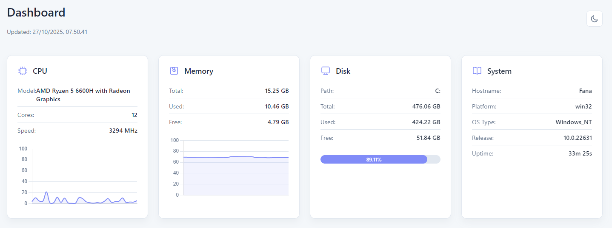
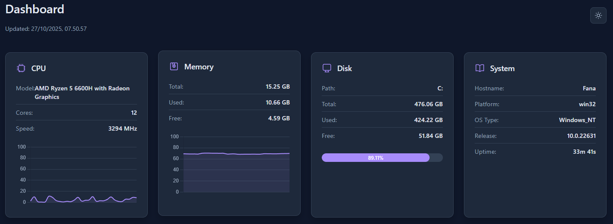

# FanaTop: Real-Time System Monitoring Dashboard

A lightweight and modern real-time dashboard to monitor your system's vital resources like CPU, Memory, and Disk usage. Built with a Node.js/Express backend and a clean, responsive vanilla JavaScript frontend.




## ✨ Key Features

*   📊 **Real-Time Metrics**: Fetches and displays system data every few seconds without a page refresh.
*   💻 **Comprehensive Monitoring**: Tracks key performance indicators:
    *   **CPU Usage**: Real-time percentage, model info, and core count.
    *   **Memory Usage**: Total, used, and free RAM.
    *   **Disk Usage**: Total, used, and free space on the primary drive.
*   🎨 **Beautiful UI**: Clean, minimalist interface with smooth animations and data visualizations powered by Chart.js.
*   🌗 **Light & Dark Modes**: Switch between themes with a single click. Your preference is saved locally.
*   📱 **Fully Responsive**: Looks great on any device, from a wide desktop monitor to a small mobile screen.
*   🚀 **Lightweight & Simple**: No heavy frontend frameworks. Just vanilla HTML, CSS, and JavaScript.
*   🔌 **Extensible API**: A simple `/api/metrics` endpoint provides all system data in a clean JSON format.

## 🛠️ Tech Stack

*   **Backend**: Node.js, Express.js
*   **Core Libraries**: `os`, `diskusage`
*   **Frontend**: HTML5, CSS3, Vanilla JavaScript
*   **Data Visualization**: Chart.js

## 🚀 Getting Started

Follow these instructions to get a copy of the project up and running on your local machine.

### Prerequisites

Make sure you have Node.js and npm (or yarn/pnpm) installed on your system.
*   [Node.js](https://nodejs.org/) (v16 or higher is recommended)

### Installation

1.  **Clone the repository:**
    ```bash
    git clone https://github.com/MasFana/fanatop
    ```

2.  **Navigate to the project directory:**
    ```bash
    cd fanatop
    ```

3.  **Install the dependencies:**
    ```bash
    npm install
    ```

4.  **Run the server:**
    ```bash
    npm start
    ```

5.  **Open your browser** and navigate to `http://localhost:8900` to see the dashboard in action!

## ⚙️ API Endpoint

The dashboard is powered by a single API endpoint that provides all the metrics.

*   **Endpoint**: `GET /api/metrics`
*   **Description**: Returns a JSON object containing CPU, memory, disk, and system information.

**Example Response:**
```json
{
    "memory": {
        "total": "15.25",
        "used": "14.13",
        "free": "1.12",
        "usagePercent": "92.68"
    },
    "cpu": {
        "cores": 12,
        "model": "AMD Ryzen 5 6600H with Radeon Graphics",
        "speed": 3294,
        "usage": "15.93"
    },
    "disk": {
        "total": "476.06",
        "used": "424.20",
        "free": "51.86",
        "usagePercent": "89.11",
        "path": "C:"
    },
    "system": {
        "platform": "win32",
        "hostname": "Fana",
        "uptime": 1183.156,
        // ... and other system details
    },
    "timestamp": "2025-10-27T00:36:59.516Z"
}